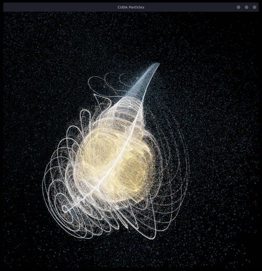
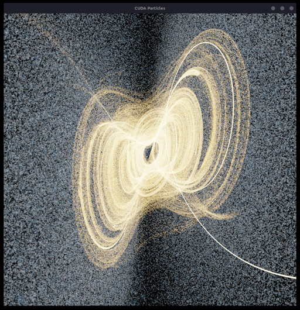

# Chaotic Attractor Music Visualizer

This README was updated on (MM/DD/YYY): 11/07/2023

## Description

The purpose of this project is to recreate [this music visualizer (CONTAINS FLASHING LIGHTS)](https://youtu.be/G6m-d52-HP8?si=lthNN81XR5K6B-id) that I made in 2017/2018, but from "scratch" and with much higher performance. The original visualizer was made in [Processing 3](https://processing.org/).

## TODO

### Core

- [x] ~~OpenGL particles~~
- [x] ~~CUDA computing~~
- [x] ~~Audio playback (and pipe audio data to CUDA kernel)~~
- [x] ~~FFT preprocessing~~ Implemented using FFTW in `AudioProcessor` class
- [x] ~~Audio visualization helpers (e.g. smoothing, etc.)~~ Implemented in `AudioProcessor` and `SpectrumVisualizer` classes
- [X] Color palette for particles based on audio spectrum
- [ ] Automatic attractor switching
- [ ] Automatic camera movement

### Extras

- [ ] Post-processing effects (e.g. bloom/glare, chromatic aberration, depth of field, etc.)
- [ ] Physics loop independent of rendering loop
- [ ] FFT loop at multiple rate of audio playback loop (divide audio playback buffers into smaller chunks for FFT)
- [ ] Refactor/reduce Makefile
- [ ] UML diagram of class structure, UML diagram of CPU/GPU/IO data flow

## Screenshots




## Libraries/APIs Used (Dependencies)

- OpenGL - *graphics API*
- GLFW - *windowing library*
- CUDA - *parallel computing platform*
- PortAudio - *audio device I/O library*
- libsndfile - *audio file I/O library*
- FFTW - *fast Fourier transform library*

## How to Run

1. Make sure you have the dependencies installed (see above).
2. Place an audio file in `/audio`, update the name of the audio file being read in `Main.cpp` (currently `follow.wav`).
3. Then simply do

    ```bash
    make run
    ```

    to build and run the program.

## File Structure

Building involves the `g++` and `nvcc` compilers. The `g++` compiler compiles `.cpp` files into object files and `nvcc` compiles `.cu` files into object files. Then `g++` links all the object files into a single executable.
